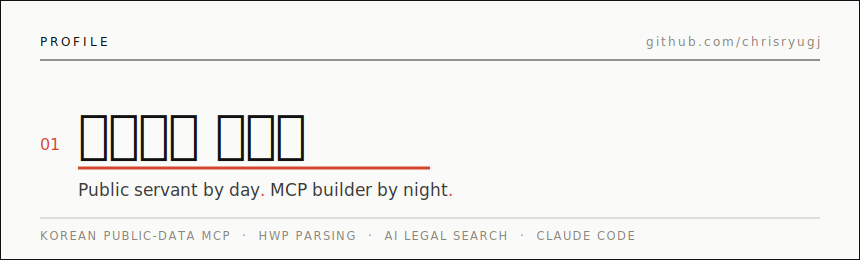

<picture>
  <source media="(prefers-color-scheme: dark)" srcset="./assets/header-dark.svg">
  
</picture>

<br>


&nbsp;·&nbsp; 낮엔 공문 결재, 밤엔 Claude랑 바이브코딩

## 02 · Stack

| | |
|---|---|
| **Build** | TypeScript · Rust · Python |
| **Ship** | Vercel · MCP · Claude Code |
| **Parse** | HWP · HWPX · PDF · Office → Markdown |
| **Domain** | 법제처 API · 공공데이터 · 정부 문서 |

## 03 · Selected Work

| | | |
|---|---|---|
| [**korean-law-mcp**](https://github.com/chrisryugj/korean-law-mcp) | 법제처 국가법령정보 MCP — 법령·판례·조례 + 인용 환각 검증 |  |
| [**kordoc**](https://github.com/chrisryugj/kordoc) | 모두 파싱해버리겠다 — HWP·HWPX·PDF·Office → Markdown |  |
| [**Docufinder**](https://github.com/chrisryugj/Docufinder) | 파일을 찾지 말고, 내용을 찾으세요 — 로컬 문서 본문 검색 |  |
| [**korean-dart-mcp**](https://github.com/chrisryugj/korean-dart-mcp) | OpenDART 전자공시 MCP — 공시·재무·지분·XBRL |  |
| [**korean-stats-mcp**](https://github.com/chrisryugj/korean-stats-mcp) | KOSIS 통계 MCP — 이제 사이트에 들어가지 않습니다 |  |
| [**lexdiff**](https://github.com/chrisryugj/lexdiff) | 한국 법령 AI 검색 — 자연어 질문 → 원문 근거 답변 |  |

## 04 · Signals

[](https://tokscale.ai/u/chrisryugj)

[](https://github.com/chrisryugj)

## 05 · Currently

```text
Day job       공무원 · Public AX Evangelist
Side quest    한국 공공데이터 MCP 서버들 · HWP 파싱 · AI 법령검색
Ask me about  Claude Code · MCP · HWPX · 법제처 API
Fun fact      GitHub 별 4,000+개가 전부 딴짓의 산물
```

## 06 · Elsewhere

[**Blog**](https://chris.gomdori.app) &nbsp;·&nbsp; [**Threads**](https://www.threads.com/@chris_gomdori) &nbsp;·&nbsp; [**Email**](mailto:ryuseungin@gmail.com)

---

<picture>
  <source media="(prefers-color-scheme: dark)" srcset="https://raw.githubusercontent.com/chrisryugj/chrisryugj/output/github-contribution-grid-snake-dark.svg">
  
</picture>

<sub>One must imagine a public servant happy. &nbsp;·&nbsp; 딴짓은 멈추지 않는다.</sub>
